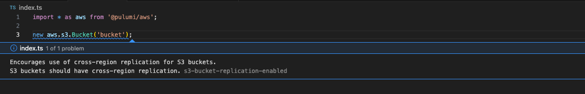

# Pulumi Diagnostics LSP

LSP Server for Pulumi IaC code. Display [Pulumi Policy](https://www.pulumi.com/docs/iac/using-pulumi/crossguard/)
related diagnostic information in your editor.



## Install

### Install pulumilsp server

To install the pulumilsp server you can either download the binary for your
os/arch and place it somewhere in your path.

For example, to download the artifacts for `darwin-arm64`:

> [!NOTE]
> This will also download the vscode plugin *.vsix file. More on that later

```console
$ gh release download --repo corymhall/pulumilsp --pattern '*-darwin-arm64*' --dir ~/Downloads
```

Then you can unzip and move the `pulumilsp` binary to somewhere on your path
(e.g. for tag `v0.0.3`).

```console
$ tar -xvzf ~/Downloads/pulumilsp-0.0.3-darwin-arm64.tar.gz -C /usr/local/bin pulumilsp
```


### Install the vscode client

To install the vscode LSP client for `pulumilsp`. First download the `*.vsix`
plugin file. If you have followed the steps above to install the `pulumilsp`
server then this has already been downloaded.

For example, to download the artifacts for `darwin-arm64`:

```console
$ gh release download --repo corymhall/pulumilsp --pattern '*-darwin-arm64*.vsix' --dir ~/Downloads
```

Then install the vscode plugin (e.g. for tag v0.0.3).

```console
$ code --install-extension ~/Downloads/pulumilsp-client-darwin-arm64-0.0.3.vsix
```
